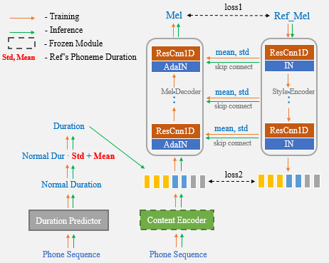

## Unet-TTS: Improving Unseen Speaker and Style Transfer in One-shot Voice Cloning
Email: rayn.li@cloudminds.com

Our proposed algorithm has powerful speaker and style transfer capabilities, especially excellent imitation of out-of-domain emotions.
- No fine-tuning required, just a few seconds of target audio
- Synthesize arbitrary text
- Embedding pause, stess, and other speaking styles in speech

[see demo](https://cmsmartvoice.github.io/Unet-TTS/)

[paper link](https://arxiv.org/abs/2109.11115)

We will soon release the source code.

One-shot voice cloning aims to transform speaker voice and speaking style in speech synthesized from a text-to-speech (TTS) system, where only a shot recording from the target speech can be used. Out-of-domain transfer is still a challenging task, and one important aspect that impacts the accuracy and similarity of synthetic speech is the conditional representations carrying speaker or style cues extracted from the limited references. In this paper, we present a novel one-shot voice cloning algorithm called Unet-TTS that has good generalization ability for unseen speakers and styles. Based on a skip-connected U-net structure, the new model can efficiently discover speaker-level and utterance-level spectral feature details from the reference audio, enabling accurate inference of complex acoustic characteristics as well as imitation of speaking styles into the synthetic speech. According to both subjective and objective evaluations of similarity, the new model outperforms both speaker embedding and unsupervised style modeling (GST) approaches on an unseen emotional corpus.

