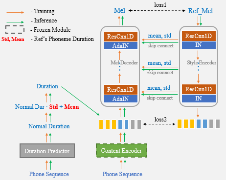

## Unet-TTS: Improving Unseen Speaker and Style Transfer in One-shot Voice Cloning
Email: rayn.li@cloudminds.com

## Abstract
One-shot voice cloning aims to transform speaker voice and speaking style in speech synthesized from a text-to-speech (TTS) system, where only a shot recording from the target speech can be used. Out-of-domain transfer is still a challenging task, and one important aspect that impacts the accuracy and similarity of synthetic speech is the conditional representations carrying speaker or style cues extracted from the limited references. In this paper, we present a novel one-shot voice cloning algorithm called Unet-TTS that has good generalization ability for unseen speakers and styles. Based on a skip-connected U-net structure, the new model can efficiently discover speaker-level and utterance-level spectral feature details from the reference audio, enabling accurate inference of complex acoustic characteristics as well as imitation of speaking styles into the synthetic speech. According to both subjective and objective evaluations of similarity, the new model outperforms both speaker embedding and unsupervised style modeling (GST) approaches on an unseen emotional corpus.

**We will soon release the source code.**

## Demo (One-shot Unseen Emotion Transfer)

**Model Description:**  
**Unet-TTS** - Our proposed model  
**GST** - Tacotron with unsupervised style modeling of GST  
**SpkEmbed** - Tacotron with speaker embedding  

These reference emotion speech to be transferred are unseen in the training process.

## 1. Same Text as Reference

#### Neutral
- 七十六万八千四百四十四 <audio src="res/test/parallel/neutral01_gt.wav" controls preload></audio>

|    Unet-TTS      |      GST     |    SpkEmbed    |
|:---------------: |:------------:|:--------------:|
| <audio src="res/test/parallel/neutral01_unet.wav" controls preload></audio>  | <audio src="res/test/parallel/neutral01_gst.wav" controls preload></audio> | <audio src="res/test/parallel/neutral01_spk.wav" controls preload></audio> |

- 希望以后找个老师好好学一下 <audio src="res/test/parallel/neutral02_gt.wav" controls preload></audio>

|    Unet-TTS      |      GST     |    SpkEmbed    |
|:---------------: |:------------:|:--------------:|
| <audio src="res/test/parallel/neutral02_unet.wav" controls preload></audio>  | <audio src="res/test/parallel/neutral02_gst.wav" controls preload></audio> | <audio src="res/test/parallel/neutral02_spk.wav" controls preload></audio> |

#### Angry
- 我不怎么在乎这个店有没有名 <audio src="res/test/parallel/angry01_gt.wav" controls preload></audio>

|    Unet-TTS      |      GST     |    SpkEmbed    |
|:---------------: |:------------:|:--------------:|
| <audio src="res/test/parallel/angry01_unet.wav" controls preload></audio>  | <audio src="res/test/parallel/angry01_gst.wav" controls preload></audio> | <audio src="res/test/parallel/angry01_spk.wav" controls preload></audio> |

- 我觉得并不是非要有特别的品质 <audio src="res/test/parallel/angry02_gt.wav" controls preload></audio>

|    Unet-TTS      |      GST     |    SpkEmbed    |
|:---------------: |:------------:|:--------------:|
| <audio src="res/test/parallel/angry02_unet.wav" controls preload></audio>  | <audio src="res/test/parallel/angry02_gst.wav" controls preload></audio> | <audio src="res/test/parallel/angry02_spk.wav" controls preload></audio> |

#### Surprise
- 但是有时夏天比其它季节更迷人 <audio src="res/test/parallel/surprise01_gt.wav" controls preload></audio>

|    Unet-TTS      |      GST     |    SpkEmbed    |
|:---------------: |:------------:|:--------------:|
| <audio src="res/test/parallel/surprise01_unet.wav" controls preload></audio>  | <audio src="res/test/parallel/surprise01_gst.wav" controls preload></audio> | <audio src="res/test/parallel/surprise01_spk.wav" controls preload></audio> |

- 不管怎么说主队好象是志在夺魁 <audio src="res/test/parallel/surprise02_gt.wav" controls preload></audio>

|    Unet-TTS      |      GST     |    SpkEmbed    |
|:---------------: |:------------:|:--------------:|
| <audio src="res/test/parallel/surprise02_unet.wav" controls preload></audio>  | <audio src="res/test/parallel/surprise02_gst.wav" controls preload></audio> | <audio src="res/test/parallel/surprise02_spk.wav" controls preload></audio> |

#### Happy
- 我必须再次感谢您的慷慨相助 <audio src="res/test/parallel/happy01_gt.wav" controls preload></audio>

|    Unet-TTS      |      GST     |    SpkEmbed    |
|:---------------: |:------------:|:--------------:|
| <audio src="res/test/parallel/happy01_unet.wav" controls preload></audio>  | <audio src="res/test/parallel/happy01_gst.wav" controls preload></audio> | <audio src="res/test/parallel/happy01_spk.wav" controls preload></audio> |

- 你女儿和她妈妈长得很像 <audio src="res/test/parallel/happy02_gt.wav" controls preload></audio>

|    Unet-TTS      |      GST     |    SpkEmbed    |
|:---------------: |:------------:|:--------------:|
| <audio src="res/test/parallel/happy02_unet.wav" controls preload></audio>  | <audio src="res/test/parallel/happy02_gst.wav" controls preload></audio> | <audio src="res/test/parallel/happy02_spk.wav" controls preload></audio> |

#### Sad
- 你的身影总是在我心里晃来晃去 <audio src="res/test/parallel/sad01_gt.wav" controls preload></audio>

|    Unet-TTS      |      GST     |    SpkEmbed    |
|:---------------: |:------------:|:--------------:|
| <audio src="res/test/parallel/sad01_unet.wav" controls preload></audio>  | <audio src="res/test/parallel/sad01_gst.wav" controls preload></audio> | <audio src="res/test/parallel/sad01_spk.wav" controls preload></audio> |

- 你不应该害怕开始一段新的感情 <audio src="res/test/parallel/sad02_gt.wav" controls preload></audio>

|    Unet-TTS      |      GST     |    SpkEmbed    |
|:---------------: |:------------:|:--------------:|
| <audio src="res/test/parallel/sad02_unet.wav" controls preload></audio>  | <audio src="res/test/parallel/sad02_gst.wav" controls preload></audio> | <audio src="res/test/parallel/sad02_spk.wav" controls preload></audio> |

## 2. Arbitrary Text (AT)
**(The text of the reference is the same as above)**

#### Neutral
- AT1: 多地农村出现了空心化的趋势
- AT2: 恰好成为可以互相参照的对象

|    Reference     |   Unet-TTS   |       GST      |
|:---------------: |:------------:|:--------------:|
| <audio src="res/test/non-parallel/neutral01_gt.wav" controls preload></audio>  | <audio src="res/test/non-parallel/neutral01_unet.wav" controls preload></audio> | <audio src="res/test/non-parallel/neutral01_gst.wav" controls preload></audio> |
| <audio src="res/test/non-parallel/neutral02_gt.wav" controls preload></audio>  | <audio src="res/test/non-parallel/neutral02_unet.wav" controls preload></audio> | <audio src="res/test/non-parallel/neutral02_gst.wav" controls preload></audio> |

#### Angry
- AT1: 本音频由一句话风格迁移语音合成系统合成
- AT2: 这些颜色也不太适合你

|    Reference     |   Unet-TTS   |       GST      |
|:---------------: |:------------:|:--------------:|
| <audio src="res/test/non-parallel/angry01_gt.wav" controls preload></audio>  | <audio src="res/test/non-parallel/angry01_unet.wav" controls preload></audio> | <audio src="res/test/non-parallel/angry01_gst.wav" controls preload></audio> |
| <audio src="res/test/non-parallel/angry02_gt.wav" controls preload></audio>  | <audio src="res/test/non-parallel/angry02_unet.wav" controls preload></audio> | <audio src="res/test/non-parallel/angry02_gst.wav" controls preload></audio> |

#### Surprise
- AT1: 他讲的笑话让我笑个不停
- AT2: 他们的配合值得我们学习

|    Reference     |   Unet-TTS   |       GST      |
|:---------------: |:------------:|:--------------:|
| <audio src="res/test/non-parallel/surprise01_gt.wav" controls preload></audio>  | <audio src="res/test/non-parallel/surprise01_unet.wav" controls preload></audio> | <audio src="res/test/non-parallel/surprise01_gst.wav" controls preload></audio> |
| <audio src="res/test/non-parallel/surprise02_gt.wav" controls preload></audio>  | <audio src="res/test/non-parallel/surprise02_unet.wav" controls preload></audio> | <audio src="res/test/non-parallel/surprise02_gst.wav" controls preload></audio> |

#### Happy
- AT1: 听起来你们玩得也很开心
- AT2: 你们到底有完没完了

|    Reference     |   Unet-TTS   |       GST      |
|:---------------: |:------------:|:--------------:|
| <audio src="res/test/non-parallel/happy01_gt.wav" controls preload></audio>  | <audio src="res/test/non-parallel/happy01_unet.wav" controls preload></audio> | <audio src="res/test/non-parallel/happy01_gst.wav" controls preload></audio> |
| <audio src="res/test/non-parallel/happy02_gt.wav" controls preload></audio>  | <audio src="res/test/non-parallel/happy02_unet.wav" controls preload></audio> | <audio src="res/test/non-parallel/happy02_gst.wav" controls preload></audio> |

#### Sad
- AT1: 我只打算放松一下自己
- AT2: 我知道人生并不总是一帆风顺

|    Reference     |   Unet-TTS   |       GST      |
|:---------------: |:------------:|:--------------:|
| <audio src="res/test/non-parallel/sad01_gt.wav" controls preload></audio>  | <audio src="res/test/non-parallel/sad01_unet.wav" controls preload></audio> | <audio src="res/test/non-parallel/sad01_gst.wav" controls preload></audio> |
| <audio src="res/test/non-parallel/sad02_gt.wav" controls preload></audio>  | <audio src="res/test/non-parallel/sad02_unet.wav" controls preload></audio> | <audio src="res/test/non-parallel/sad02_gst.wav" controls preload></audio> |